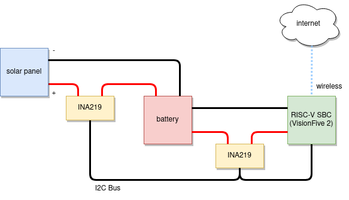

# Open Green Compute

**_Note_**: work in progress.

Simple [Rust](https://www.rust-lang.org/) based application to measure (and maybe later control) power inputs (e.g. from a solar panel) and output (e.g. the power used by a [RaspberryPi](https://www.raspberrypi.org/) of [VisionFive 2](https://www.starfivetech.com/en/site/boards) single board computer. Goal is to see if we can run a single board computer 24/7 on green energy. 

This was initially created to measure the power consumption of a Raspberry Pi 4 which was powered by a battery bank which in turn was powered by a set of solar-panels. It has also been tested with the [RISC-V](https://riscv.org/) based VisionFive 2. 

The power sensors make use of [INA219](https://www.ti.com/product/INA219) based sensors over an [I2C](https://en.wikipedia.org/wiki/I%C2%B2C) bus. While the weather data is collected through [Weather API](https://openweathermap.org/api).

Reason for collecting both power and weather data is to better understand the behaviour of the solar panels under various weather conditions. This should enable better forecasting of the amount of power that will be available in near future, given the current weather.

The following block diagram shows the system setup:

The collected data will look like the table shown below - this data in turn can be used to train a forecasting model that should help build a model based feedback control bases system.

| timestamp | compute_voltage |  compute_current |    compute_power | solar_voltage | solar_current | solar_power | owa_temperature | ... | owa_cloud_coverage |
|----------:|----------------:|-----------------:|-----------------:|--------------:|--------------:|------------:|----------------:|:---:|-------------------:|
|  21:36:58 |           4.708 | 1174.71036585366 | 5563.71951219512 |             0 |             0 |           0 |           11.92 | ... |                 75 |
|  21:37:02 |           4.724 | 1164.74085365854 | 5502.43902439024 |             0 |             0 |           0 |           11.91 | ... |                 75 | 
|       ... |             ... |              ... |              ... |           ... |           ... |         ... |             ... | ... |                ... |

## Configuration

By default, the configuration file is loaded from *defaults.toml*. You can set an environment variable called OGC_CONFIG to load it from any other path.

An example configuration file can be found [here](defaults.toml).

## Systemd unit file

To run this as a service using systemd use the following unit file:

    [Unit]
    Description=Open Green Compute
    After=multi-user.target
    
    [Service]
    ExecStart=/<path to>/open_green_compute
    WorkingDirectory=/home/ubuntu
    Restart=always
    RestartSec=10s
    
    [Install]
    WantedBy=multi-user.target

## Compiling for RISC-V

Make sure the right target toolchain and compiler are installed on your host:

    rustup target add riscv64gc-unknown-linux-gnu
    apt-get install gcc-riscv64-linux-gnu

## Wishlist

  * OpenTelemetry support
  * dashboard
  * database storage
